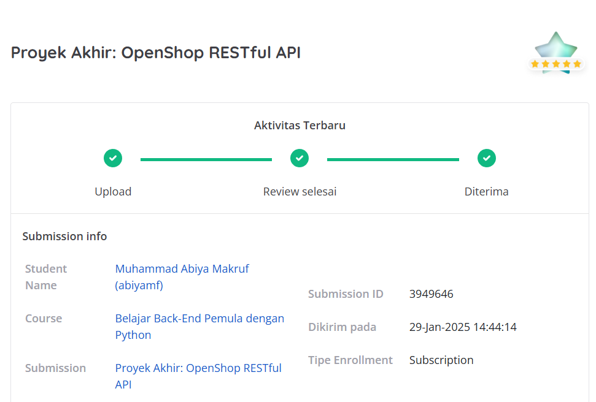

# Proyek Akhir: Belajar Back-End Pemula dengan Python
## Penilaian Proyek
Proyek ini berhasil mendapatkan bintang 5/5 pada submission dicoding course Belajar Back-End Pemula dengan Python.



# 📜 Dicoding OpenShop RESTful API

## 📌 Studi Kasus

Sebagai seorang Back-End Developer, Anda memutuskan untuk bergabung dengan tim TSC (Technical Steering Committee) dalam mengembangkan sebuah platform e-commerce yang diberi nama **OpenShop**. Seperti namanya, OpenShop akan menjadi platform penjualan yang dapat diakses oleh siapa saja dengan mudah, serta memungkinkan para penjual dari berbagai kategori produk untuk menawarkan barang-barang mereka secara online.

Aplikasi ini akan dikembangkan secara bertahap, dimulai dari fitur-fitur dasar seperti menambahkan produk, mengelola inventaris, hingga membuat kategori produk. Di masa mendatang, OpenShop diharapkan memiliki kemampuan untuk memungkinkan pengguna membuat wishlist, melakukan filter pencarian produk, hingga membandingkan harga antar toko. Aplikasi ini dirancang untuk menjadi salah satu platform penjualan terbaik di dunia!

Pada tahap pertama, tim TSC bertanggung jawab membangun API dasar untuk OpenShop. Pada tahap ini, API akan menangani pengelolaan produk di dalam database, termasuk fitur untuk menambahkan, menghapus, dan mengubah informasi produk.

Tugas Anda adalah merancang dan membangun API untuk OpenShop sesuai dengan kriteria yang akan dijelaskan pada materi selanjutnya.

## 📌 Deskripsi

Proyek ini adalah implementasi backend untuk aplikasi OpenShop, dikembangkan sebagai proyek akhir dalam kursus "Belajar Back-End Pemula dengan Python" di Dicoding. Aplikasi ini menyediakan RESTful API untuk manajemen produk dan transaksi penjualan, memungkinkan operasi CRUD (Create, Read, Update, Delete) dengan fitur autentikasi yang aman. 🔥

## 📂 Struktur Direktori
```
Dicoding-OpenShopRESTfulAPI/
│── open_shop_app_back_end/  # Direktori proyek Django utama 🏗️
│   └── settings.py          # Pengaturan konfigurasi Django ⚙️
│   └── urls.py              # Konfigurasi URL aplikasi 🌐
│   └── wsgi.py              # Entry point untuk WSGI server 🚀
│── openShop/                # Aplikasi utama untuk manajemen toko 🛒
│   └── models.py            # Definisi model database 🗄️
│   └── views.py             # Logika tampilan dan kontroler 🎛️
│   └── serializers.py       # Serialisasi data untuk API 📦
│   └── urls.py              # Konfigurasi URL spesifik aplikasi 🌐
│── postman/                 # Koleksi Postman untuk pengujian API 📬
│── Pipfile                  # Daftar dependensi proyek 📦
│── Pipfile.lock             # Versi terkunci dari dependensi 🔒
│── manage.py                # Skrip manajemen Django ⚙️
│── db.sqlite3               # Database SQLite (opsional) 🗄️
```

## 🚀 Instalasi
Pastikan Anda sudah menginstal **Python** dan **pipenv** sebelum memulai.

1️⃣ Clone repository ini:
```bash
git clone https://github.com/AbiyaMakruf/Dicoding-OpenShopRESTfulAPI.git
cd Dicoding-OpenShopRESTfulAPI
```

2️⃣ Buat virtual environment dan instal dependensi:
```bash
pipenv shell
pipenv install
```

3️⃣ Jalankan migrasi database:
```bash
python manage.py migrate
```

4️⃣ Jalankan server Django:
```bash
python manage.py runserver
```
Aplikasi akan berjalan di `http://127.0.0.1:8000/` 🌍

## 🛠️ Pengujian Menggunakan Postman

Ketika membangun OpenShop RESTful API, tentu Anda perlu menguji untuk memastikan API berjalan sesuai dengan kriteria yang diminta. Kami sudah menyediakan berkas **Postman Collection dan Environment** yang dapat Anda gunakan untuk pengujian. Berkas ini dapat diakses di folder `./postman`.

Anda perlu meng-import kedua berkas tersebut ke dalam Postman untuk menggunakannya. Caranya, ekstrak berkas yang sudah diunduh hingga menghasilkan empat file JSON:

- **OpenShop API Test With Soft Delete Collection dan Environment**: Untuk Anda yang mengerjakan kriteria soft delete.
- **OpenShop API Test Without Soft Delete Collection dan Environment**: Untuk Anda yang belum mengerjakan kriteria soft delete.

### Langkah-langkah Import di Postman
1. Buka aplikasi **Postman**.
2. Klik tombol **Import** yang berada di atas panel kiri aplikasi Postman.
3. Klik tombol **Upload Files** dan pilih kedua berkas JSON hasil ekstraksi.
4. Setelah diimpor, **OpenShop RESTful API Test Collection** dan **Environment** akan tersedia di Postman Anda.

**Catatan:** Jangan pernah mengubah urutan collection yang telah diimport.


## 📋 API Endpoint
| Method | Endpoint             | Deskripsi                  |
|--------|----------------------|----------------------------|
| GET    | `/api/products/`     | Mendapatkan semua produk 🛍️ |
| POST   | `/api/products/`     | Menambahkan produk baru 🆕 |
| GET    | `/api/products/{id}/`| Mendapatkan detail produk 🔍 |
| PUT    | `/api/products/{id}/`| Memperbarui produk ✏️ |
| DELETE | `/api/products/{id}/`| Menghapus produk ❌ |

## 🛠️ Teknologi yang Digunakan
- Python 🐍
- Django & Django REST Framework 🏗️
- SQLite (dapat diganti dengan PostgreSQL) 🗄️

## 📢 Kontribusi
Kontribusi sangat diterima! 🤝
1. Fork repo ini 🍴
2. Buat branch baru: `git checkout -b fitur-anda`
3. Commit perubahan: `git commit -m 'Menambahkan fitur keren'`
4. Push branch Anda: `git push origin fitur-anda`
5. Buat Pull Request 📬
--

Terima kasih telah menggunakan proyek ini! ✨ Selamat coding! 🚀

